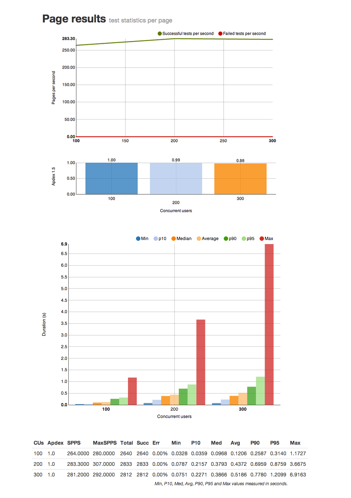
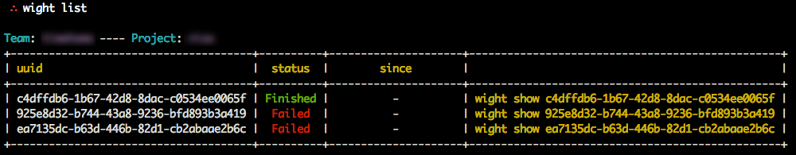
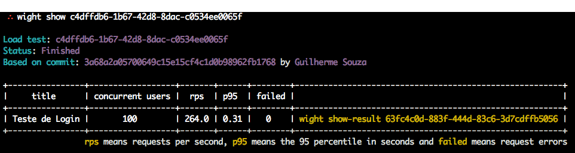

.. wight documentation master file, created by
   sphinx-quickstart on Wed Aug  7 14:06:48 2013.
   You can adapt this file completely to your liking, but it should at least
   contain the root `toctree` directive.

Wight - Overview
================

Wight is a continuous load testing tool.

It enables developers to keep track of whether their code is evolving performance-wise.

It's a great tool to spot performance issues and bottlenecks.

Web Reports
-----------

While the way of using Wight daily is through the CLI, it comes bundled with reports that make it easy to understand more about your application.

Wight breaks the results into three different units: `tests`, `pages` and `requests`.

Tests are the actual units you write using `funkload`_. Wight runs your tests many times and report them back to you.

Each test requests pages to the product being tested. Each page requested gets tracked independently. In a given test you may request more than one page (get and post a login page, then get an index page, for example).

Requests only differ from the pages if the test being run is not being run under simple-fetch. Simple-fetch only gets the page HTML, but does not parse it. If the test is not run with simple-fetch, then the page is parsed and all the resources (js, css, images) are also downloaded.

This means that usually the `# of requests >= # of pages >= # of tests`.

*An example of the reports for a test (just a sample portion of the report data shown for clarity)*:

Command Line Interface - CLI
----------------------------

After installing Wight, you'll have a few commands available to you. One of them is the `wight` CLI.

The CLI is the toolbelt that allows developers to interact with wight when scheduling tests or adding new projects.

The most important thing is the endpoint that the CLI will be talking to. We call that the `target`.

To learn more about how to use the CLI, head to the :doc:`getting-started` page.

API
---

To support the CLI, Wight comes baked in with a fully-fledged API, meaning that if you want to automate it using something other than the CLI, it's very simple.

The API is "RESTish", so it's fairly easy to grasp. Sometimes, though, for the sake of performance or clarity, the team chose to create routes that improve the whole system in spite of purity.

To learn more about the API, head to the :doc:`api` page.

Contents
--------

.. toctree::
    :maxdepth: 2

    getting-started
    reports
    cli-usage
    api
    provisioning
    architecture
    release-notes
    contributors
    licensing

.. _funkload: http://funkload.nuxeo.org
